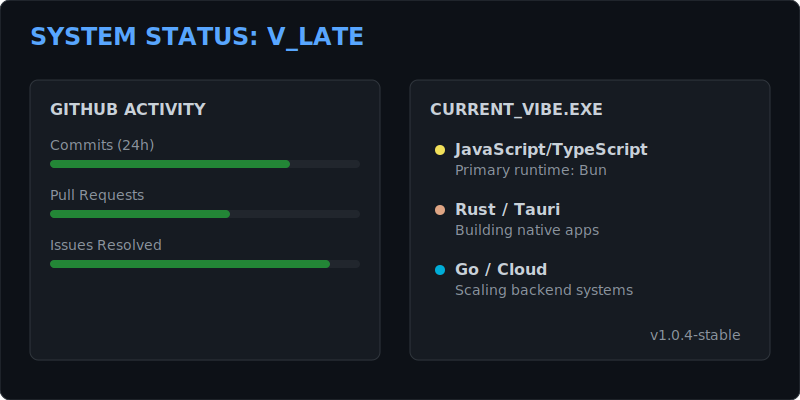
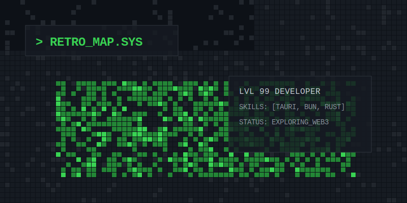
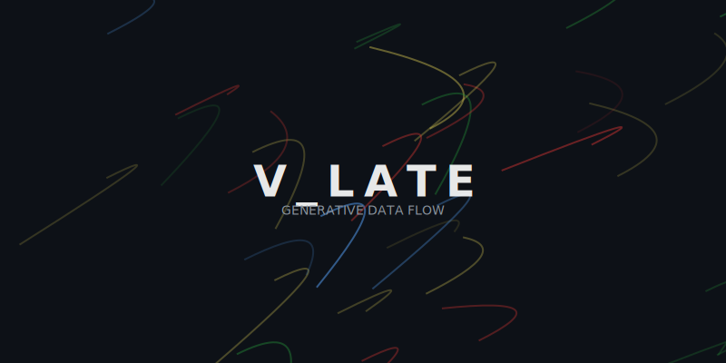

# Visual Options Preview

Here are the visual directions for your GitHub README overhaul.

---

### Option 1: The "Dynamic Dashboard" (SVG-based)
**Vibe:** Professional, data-rich, HUD.

---

### Option 2: The Pixel Art Grid (Image Tiles)
**Vibe:** 8-bit RPG, retro, skill-map.

---

### Option 3: The "Generative Profile" (Data Art)
**Vibe:** Abstract, modern, evolving.

---

### How to preview these:
Open the `previews/` folder or view this `PREVIEW.md` file in your editor's Markdown previewer to see the rendered SVGs.
